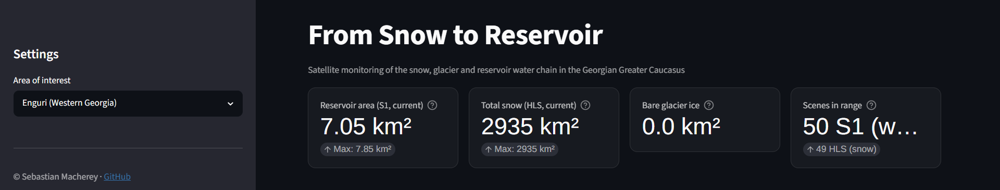
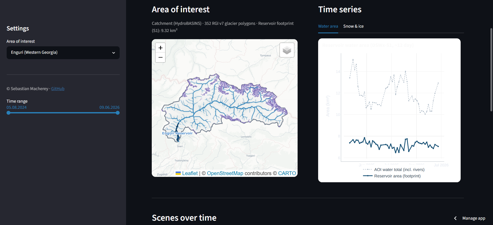
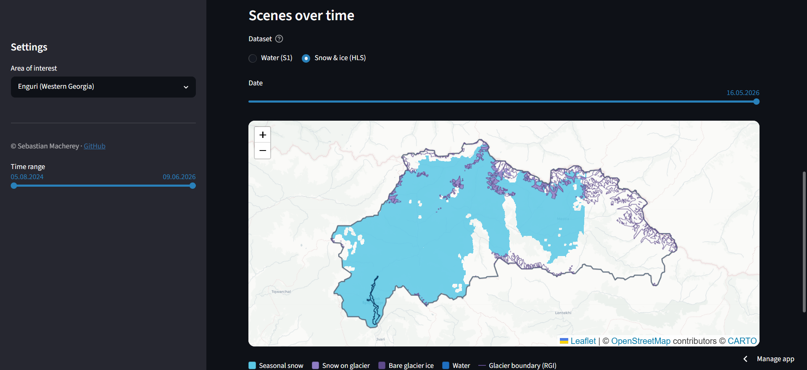
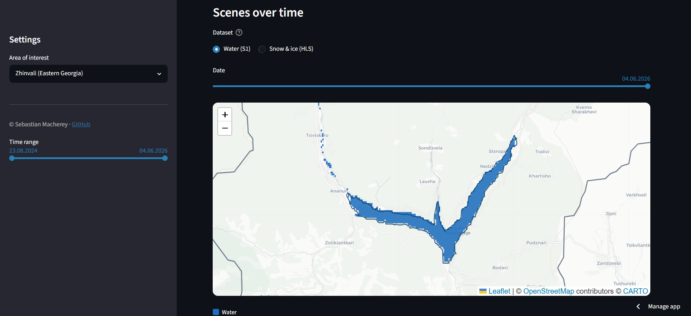

# FROM SNOW TO RESERVOIR
### Satellite monitoring of the snow, glacier and reservoir water chain in the Georgian Greater Caucasus

© Sebastian Macherey, [github.com/sebastianmry/from-snow-to-reservoir](https://github.com/sebastianmry/from-snow-to-reservoir)

**Live app: [from-snow-to-reservoir.streamlit.app](https://from-snow-to-reservoir.streamlit.app/)**

---

## Dashboard

The interactive Streamlit dashboard gives each area of interest three linked views: headline metrics, the catchment map with the water time series, and a date-slider scene browser for the raw satellite scenes.









---

## Motivation

Georgia's electricity supply depends on hydropower for roughly 80%. Seasonal snowmelt and rainfall drive most of the inflow into the reservoirs, while glacier melt of the Greater Caucasus adds a smaller but climate-sensitive contribution that sustains the rivers in late summer once the seasonal snow is gone. Climate change is reshaping this balance: warmer winters shift precipitation from snow to rain and shrink the glaciers, which makes the inflow more variable and harder to plan for.

This matters because both reservoirs studied here sit directly next to the Russia-controlled territories of Abkhazia (Enguri) and South Ossetia (Zhinvali). The Enguri complex is shared across that boundary, with the dam on the Georgian-controlled side and the power station inside Abkhazia, so its operation depends on a fragile cross-boundary arrangement. Zhinvali supplies most of the drinking water and a large share of the power for Tbilisi from a catchment that reaches towards South Ossetia. Ground access to these headwaters is limited and politically sensitive, so satellite monitoring is the practical way to track the snow, glacier and water that feed two reservoirs critical to Georgia's energy and water security.

## Areas of Interest

The AOIs are **the catchment above each dam**, derived from HydroBASINS (the dam as pour point, the upstream sub-basins unioned, see `download_catchments.py`). The satellite download uses the **bounding box** of the catchment (plus a small buffer); the analysis statistics are additionally **masked to the catchment polygon**, so that snow, glacier and water are counted only inside the watershed.

| AOI | Catchment area | Clip box (min_lon, min_lat, max_lon, max_lat) | Reservoir (lon, lat) | Features |
|-----|----------------|-----------------------------------------------|----------------------|----------|
| Enguri | ~3,139 km² | 41.847, 42.729, 43.166, 43.278 | 42.028, 42.808 | Enguri Dam (271 m), heavily glaciated Svaneti (eastern headwaters up to Ushguli), borders Abkhazia |
| Zhinvali | ~2,089 km² | 44.313, 42.001, 45.245, 42.628 | 44.767, 42.165 | Zhinvali Dam (drinking water for Tbilisi), borders South Ossetia |

## Data

- **OPERA DSWx-HLS (Level 3):** Optical water and snow classification (B01_WTR) from Landsat 8/9 and Sentinel-2, about 2-to-3-day revisit. Cloud masking uses the WTR layer's own flag (value 253), so no separate B09 layer is needed.
- **OPERA DSWx-S1 (Level 3):** Radar-based water classification (B01_WTR), cloud-independent. Reduced to one consistent relative orbit (roughly a 12-day series).
- **Randolph Glacier Inventory v7 (RGI), Region 12:** Glacier polygons for the Caucasus (NSIDC, via `download_glaciers.py`).
- **HydroBASINS v1c (lev12):** Sub basin polygons (HydroSHEDS) used to derive the catchment above the dam (pour-point delineation, via `download_catchments.py`). Defines the AOI box and the analysis mask.
- **HydroRIVERS v10:** River network (HydroSHEDS), filtered to the catchment above the dam (via `download_rivers.py`).
- **HydroLAKES v1.0:** Reservoir polygons (HydroSHEDS) used as a *seed* via `download_reservoirs.py`. HydroLAKES strongly underestimates the lakes (Enguri 4.9 km² versus a real ~13 km²), so it is only a starting point; the real footprint is derived from the S1 water extent in `derive_reservoir.py`.

Time span: August 2024 to today.

### Why these products

The analysis builds on NASA OPERA DSWx, an analysis-ready Level 3 product, instead of a water or snow index computed from raw scenes. DSWx applies one documented, calibrated classification to every acquisition, so the result is reproducible, free of operator-tuned thresholds, and the radar and optical products stay directly comparable. Two DSWx variants cover the two signals the project needs.

DSWx-S1 carries the water signal. Synthetic aperture radar images through cloud and at night, and open water returns very low backscatter, which makes it a robust and long-established water indicator. The Greater Caucasus is cloudy for most of the year, so an optical water series would break into multi-month gaps. Reduced to one consistent relative orbit, the radar series stays geometrically stable and gap-free on a roughly 12-day cycle, exactly what a storage record requires.

DSWx-HLS carries the snow and glacier signal, where an optical sensor is unavoidable, because radar cannot cleanly separate dry seasonal snow from bare ground. HLS harmonises Landsat 8/9 and Sentinel-2 into a single 30 m record with a two to three day revisit, so it collects the largest possible number of cloud-free looks over a small, steep, frequently clouded basin. Water from HLS is deliberately discarded, since optical classifiers over-detect water in terrain shadow and over ice even on clear days.

The static reference layers follow community standards: the Randolph Glacier Inventory v7 for glacier outlines, and the HydroSHEDS family (HydroBASINS, HydroRIVERS, HydroLAKES) for the catchment, the river network and the reservoir seed. The delineation is therefore traceable to published, widely used datasets rather than hand-drawn geometry.

## Pipeline

```
NASA Earthdata (earthaccess)
        |
        v
download_hls.py / download_s1.py  # footprint pre-filter, in-memory clip to AOI,
        |  (download_common.py)   # all MGRS tiles, write to the tile store
        v
extract_timeseries.py             # per date: merge all tiles into an AOI mosaic (EPSG:4326),
        |                         # raster-vector overlay with RGI glaciers, quality filters
        v
render_overlays.py                # pre-render coloured PNG scene overlays (one per date)
        |
        v
app.py (Streamlit)                # interactive map (Folium) + time series (Plotly) + scene browser

Static geodata (one time):
  download_catchments.py          # HydroBASINS -> catchment polygon + AOI box -> static_data/
  download_glaciers.py            # RGI v7 Region 12 glacier polygons -> static_data/
  download_rivers.py              # HydroRIVERS, catchment above the dam -> static_data/
  download_reservoirs.py          # HydroLAKES reservoir seed -> static_data/
  derive_reservoir.py             # S1 water extent -> real reservoir footprint -> static_data/

S1 orbit selection (one time per AOI box, read-only / sampling only):
  probe_coverage.py               # stage A: footprint coverage -> candidate phases (free)
                                  # stage B (--sample N): load N test files per phase,
                                  #   measure true valid_px_pct -> best orbit = s1_anchor
```

The central AOI definition (clip box and S1 anchor per AOI) lives in `aoi_config.py`, a single source from which all scripts import.

### Catchment as the AOI

Instead of a coarse box, the AOI is the **catchment above the dam**. `download_catchments.py` loads HydroBASINS (lev12), locates the sub-basin at the dam (pour point) and, using the flow topology (`HYBAS_ID`/`NEXT_DOWN`), unions all upstream sub-basins into one catchment polygon (`static_data/catchments.geojson`). Its bounding box (plus a buffer) is the `clip_box` for the download; the polygon masks the statistics in `extract_timeseries.py`, which makes `valid_px_pct` **catchment-relative** (the denominator is catchment pixels, not the whole box). This solves three things: (1) it trims irrelevant box corners, (2) it guarantees the full watershed including all inflows (Enguri: the eastern Svaneti headwaters that the old box cut off), (3) it makes snow and glacier numbers hydrologically meaningful, since glaciers that drain elsewhere are excluded.

Tile store folder structure: `OPERA_DSWx/{hls,s1}/{enguri,zhinvali}/`

### Mosaic approach

The reservoir and the glaciers can sit in different MGRS tiles (for example Zhinvali: reservoir in the south, glaciers in the north). For that reason `download_hls.py` and `download_s1.py` load **all** tiles of the AOI (with the MGRS tile id in the filename), and `extract_timeseries.py` merges all tiles per date into one full AOI mosaic in EPSG:4326 (across UTM zone boundaries as well). The mosaic is **clipped** exactly to the AOI box (otherwise tiles from different UTM zones produce NoData corners that distort the coverage). This guarantees full-area coverage and smooths the tile noise.

### S1 orbit dedup

SAR water classification depends on the acquisition geometry (layover and shadow vary with the ascending or descending orbit), so mixing orbits in one series produces an artificial sawtooth. `extract_timeseries.py` therefore fixes S1 to **one** relative orbit per AOI (`s1_anchor`: Enguri 2024-08-30, Zhinvali 2024-08-25) and keeps only that 12-day repeat phase (`ordinal % 12`), so only about 1/4 of the dates are downloaded. A date enters the series when either the whole catchment or just the reservoir is fully observed (the coverage gate, see the Quality filters table); on a rare catchment-partial date the fully observed reservoir is kept and the non-comparable `water_km2` set to `NaN`. The Enguri anchor images the catchment in full on 49 of 50 cycles, so its basin-wide `water_km2` is essentially gap-free. The result is a clean, geometrically consistent 12-day series (Enguri 50, Zhinvali 52 scenes).

**Orbit selection (`probe_coverage.py`).** First stages A and B (footprint plus true pixel coverage on test files) yield candidate phases with about 99% coverage. But **coverage is not the same as measurement quality for the reservoir**: a second check (`--compare-orbit`) measures `reservoir_area_km2` for a few dates of a neighbouring orbit and places them next to the existing series. The **one day neighbouring orbit** is a precision test, because at one day spacing the level barely changes, so any difference is pure orbit and geometry noise. The result is a reservoir error bound of about ±0.2 km² (Zhinvali) and about ±0.2 km² (Enguri). A 2026 re-probe (after Sentinel-1C data joined DSWx-S1) confirmed that Enguri phase 7 both images the full catchment and agrees with the neighbouring orbit on the lake (full-year mean 7.23 vs 7.15 km², autumn 7.35 vs 7.27 km²), which retired the earlier concern that this phase under-detected the lake in autumn. The Enguri anchor is therefore phase 7 (2024-08-30).

### Reservoir footprint from S1

`reservoir_area_km2` measures water **only inside the reservoir**, separate from the AOI-wide water area (which also includes rivers). Because HydroLAKES strongly underestimates the lakes, `derive_reservoir.py` derives the footprint from the project's own S1 data: a **water occurrence map** is accumulated over all full-coverage scenes; pixels with water in at least 25% of the acquisitions (occurrence-based, see Pekel et al. 2016) form the reservoir, reduced to the component connected to the HydroLAKES seed. The threshold is sensitivity-checked (the area changes by only 5 to 9% across 0.10 to 0.50, with no river leakage). Result (catchment AOI): Enguri 9.32 km², Zhinvali 11.20 km² (versus a real ~13 and ~11.5; Zhinvali is a direct match). The reservoir signal is about 5 times (Enguri) to 10 times (Zhinvali) quieter than the AOI total water area and shows the seasonal storage cycle (clearly for Zhinvali: about 8.5 km² in spring rising to about 11 km² in autumn).

**Reservoir guard:** if on a given date less than 95% of the reservoir footprint is observed as valid (`reservoir_valid_pct`), `reservoir_area_km2` (and `water_km2`) is set to `NaN`, because a NoData gap over the lake would otherwise look like a false drawdown (this happened at Enguri on 2025-04-27, with only 45% of the lake observed). The robustness therefore lives in the data layer; the dashboard shows a single reservoir line, and NaN dates appear as a gap (no bridging). Storage is monitored through area, not an absolute level (see [Limitations](#limitations)).

### Scene overlays (raster browser)

`render_overlays.py` runs once after `extract_timeseries.py` and pre-renders each filtered scene as a small, coloured PNG (water blue, seasonal snow cyan, snow on glacier mid violet, bare glacier ice dark violet; cloud, NoData and areas outside the catchment are transparent). The dates come straight from the final time series parquets, so the scenes line up exactly with the charts. The dashboard loads only these finished PNGs (in `static_data/overlays/{site}/{sensor}/`) as a Folium `ImageOverlay` on a date slider, so there is no raster computation at runtime, which keeps the app light on a weak laptop.

### Cache and resume

`extract_timeseries.py` stores every date result (including skipped ones, **with their stats**) in `static_data/cache/{site}_{s1,hls}.json`. Re-runs skip already computed dates, so the expensive tile read happens only once. `--refresh` ignores the cache, `--skip-s1` and `--skip-hls` run only one sensor. `--recompute` re-reads only the result-relevant dates (`ok` plus dates that newly qualify under the *current* thresholds) and takes cloud or below threshold skips from the cache **without** a store read, which is much faster after a logic or threshold change (for example Zhinvali: 50 dates read instead of 249).

### Footprint pre-filter

Before download, the union of the tile footprints per date is checked against the AOI. Only dates whose tiles together cover at least 99% of the AOI are downloaded at all, so partial-coverage dates drop out before bandwidth is wasted (pure geometry, a few seconds).

## Quality filters

| Filter | Threshold | Rationale |
|--------|-----------|-----------|
| Catchment coverage (HLS) | at least 85% valid pixels | Catchment-relative. The eastern Enguri tip often lies at the Sentinel-2 or Landsat swath edge, so some valid scenes carry partial NoData even when all tiles are present. The real limiter is cloud (about 70 to 75% of dates). |
| Cloud cover (HLS) | at most 30% cloud in the catchment | Common threshold for optical remote sensing; cloud equals WTR flag 253. |
| Coverage gate (S1) | catchment at least 90% **or** reservoir at least 95% | A date is kept when either the whole catchment is fully imaged or the reservoir itself is fully observed. The basin-wide `water_km2` is NaN on the reservoir-only (catchment-partial) dates; the lake area is kept. Discards only scenes that miss the lake too. |
| Reservoir coverage (S1) | at least 95% of the footprint | Below this, `reservoir_area_km2` (and `water_km2`) is NaN, so NoData over the lake cannot look like a false drawdown. Also the gate that admits a catchment-partial date to the lake series. |

A compact, standalone summary of all cleaning and QA steps is in [`docs/DATA_CLEANING.md`](docs/DATA_CLEANING.md).

### HLS coverage: Sentinel-2 versus Landsat

The fluctuating HLS coverage (some dates about 99%, others about 70%) is driven by the sensor, not by chance: **Sentinel-2** (290 km swath) reliably covers the elongated, zone-crossing Enguri basin in full (every pure S2 date is at least 85%), while **Landsat 8/9** (185 km swath) covers it only partially (median about 73%). Coverage per sensor: S2A 100%, S2C 99.7%, S2B 88%, L8 73.5%, L9 74.3%. The 85% filter therefore keeps the S2-covered dates and drops the Landsat-only partial scenes, a documented optical data limit rather than a bug.

## Computed metrics (per date and AOI)

| Column | Description |
|--------|-------------|
| `water_area_km2` | Open water area in the AOI (DSWx classes 1 to 5). HLS column; for the water signal use `water_km2` from the S1 series instead. |
| `seasonal_snow_km2` | Snow cover outside the RGI glacier polygons (raw, absolute). |
| `seasonal_snow_frac` | Snow share of the **observed** (valid, cloud-free) non-glacier basin area, coverage and cloud robust. |
| `seasonal_snow_km2_est` | `seasonal_snow_frac` times the full non-glacier basin area, the coverage-corrected seasonal snow area (fills the unobserved area with the observed snow rate; **main column for the snow signal**). |
| `snow_on_glacier_km2` | Snow cover inside the RGI glacier polygons. |
| `bare_ice_km2` | Bare glacier ice (glacier area minus snow cover), a melt indicator. |
| `glacier_total_km2` | Total area of the RGI polygons in the catchment. |
| `obs_land_pct` | Share of the non-glacier basin area observed as valid and cloud-free on the date (a confidence measure for the snow estimate). |
| `cloud_cover_percent` | Share of cloudy pixels in the catchment. |
| `valid_px_pct` | Share of valid (non NoData) pixels in the catchment. |

S1 series (`*_s1_timeseries.parquet`):

| Column | Description |
|--------|-------------|
| `water_km2` | Open water area in the whole catchment (DSWx classes 1 to 5) from radar, the water signal (NaN when the reservoir guard triggers). |
| `reservoir_area_km2` | Water area **only in the reservoir** (S1 derived footprint), without rivers, quieter and level-relevant (NaN when the lake is below 95% observed). |
| `reservoir_valid_pct` | Share of validly observed pixels **inside the reservoir footprint** (the basis of the reservoir guard). |
| `valid_px_pct` | Share of valid pixels in the catchment. |

## Limitations

Satellite remote sensing sets clear limits on what this monitoring resolves, and the dashboard should be read with those limits in mind. Open satellite data alone is not a substitute for gauged hydrological measurement.

**Water is underestimated, most of all away from the reservoir.** DSWx-S1 reliably captures large, calm open water such as the reservoir body, but it misses most narrow mountain rivers and streams, which fall below the 30 m pixel. Radar geometry in steep terrain adds error, because layover, foreshortening and radar shadow in the deep valleys leave parts of a water body unclassified, and wind-roughened water raises backscatter and is easily missed. The AOI-wide `water_km2` is therefore a lower bound on the true wetted area, not a complete water census. The reservoir footprint is the most trustworthy water figure, since it is large, calm and observed repeatedly. Even there, a deep gorge reservoir like Enguri changes level far more than area, so area stays a weak proxy for storage.

**Glaciers are not detected from the imagery.** The glacier outlines come from the Randolph Glacier Inventory v7. For the Greater Caucasus these outlines were digitised from Landsat imagery of 1999 to 2002, so the glacier mask predates the study window by more than twenty years. The Caucasus has seen substantial glacier retreat since then, so the fixed mask overstates today's ice extent and cannot track that change. HLS only classifies snow on or off those static polygons, and the optical snow and ice split is coarse, because shaded slopes, thin cloud and debris-covered ice all blur the boundary. `bare_ice_km2` is a melt indicator inside a fixed glacier mask, not a measurement of glacier change.

**The optical (HLS) series is sparse.** The Greater Caucasus is cloudy for most of the year, so the 30% cloud filter passes only a minority of dates and the seasonal-snow series carries genuine multi-month gaps, mainly in autumn and winter. The coverage-corrected `seasonal_snow_km2_est` fills the unobserved fraction with the observed snow rate, which assumes the clouded area behaves like the clear area on the same day. That assumption weakens as cloud cover grows.

**No ground truth and no absolute volumes.** The project reports areas from open satellite products without in-situ discharge, snow-course or reservoir-level data, so the numbers are internally consistent relative signals, not validated absolute quantities. Freely available DEMs capture the reservoirs as a flat surface with no bathymetry, and satellite altimetry does not cover these small mountain lakes, so storage is tracked through area rather than an absolute level. The results show relative seasonal and interannual dynamics well, but they do not replace gauged measurements.

## Setup

```bash
conda create -n georgia-sar python=3.11
conda activate georgia-sar
pip install -r requirements.txt
```

Tile store (where the downloaded tiles are kept):
- The download/extract/render scripts use a local folder, `./opera_local` by default (override with the `PIPELINE_LOCAL_DIR` env var). No cloud account is needed.

NASA Earthdata login:
- Create an account at [urs.earthdata.nasa.gov](https://urs.earthdata.nasa.gov).
- On first run you are asked for username and password (stored in `_netrc`).

## Workflow

```bash
# 1. Load the static geodata once
python download_catchments.py        # HydroBASINS catchment -> catchments.geojson + clip_box
                                     # (enter the clip_box values in aoi_config.py)
python download_glaciers.py          # RGI v7 glaciers (NSIDC, NASA login)
python download_rivers.py            # HydroRIVERS catchment (public)
python download_reservoirs.py        # HydroLAKES reservoir seed (public)

# 1b. Determine the S1 orbit anchor once per AOI box (two stage)
python probe_coverage.py             # stage A: footprint screen only (free)
python probe_coverage.py --sample 3  # stage B: load 3 test files per candidate phase,
                                     #   measure true valid_px_pct -> best s1_anchor per AOI
                                     #   enter it in aoi_config.py, THEN run download_s1.py

# 2. Download and process the satellite data
python download_hls.py               # OPERA DSWx-HLS (optical) -> tile store
python download_s1.py                # OPERA DSWx-S1 (radar)    -> tile store
python derive_reservoir.py           # S1 water extent -> real reservoir footprint (once after S1 download)
python extract_timeseries.py         # mosaic + time series -> *_timeseries.parquet (HLS) + *_s1_timeseries.parquet (S1)
                                     # options: --skip-s1 / --skip-hls / --refresh / --recompute

# 3. Pre-render the scene overlays (once after extract_timeseries.py)
python render_overlays.py            # coloured PNGs per date -> static_data/overlays/
                                     # options: [enguri|zhinvali] [s1|hls] --refresh

# 4. Start the dashboard
streamlit run app.py
```

## Scripts

| Script | Purpose |
|--------|---------|
| `download_hls.py` | Download OPERA DSWx-HLS (optical, only B01_WTR, cloud via flag 253) to the tile store. |
| `download_s1.py` | Download OPERA DSWx-S1 (radar, B01_WTR) to the tile store. `orbit_filter`: loads only the anchored orbit (`s1_anchor`, one 12-day phase), about 1/4 of the dates. |
| `download_common.py` | Shared logic for both downloads: auth, tile store, footprint pre-filter, **S1 orbit pre-filter** (`orbit_phase`, anchor phase only), clipping, MGRS names. Robust download via a requests session with a hard read timeout (no hanging) plus retry and backoff for transient 5xx and 429 (not run directly). |
| `extract_timeseries.py` | Build the tile mosaic per date, mask to the catchment polygon (`valid_px_pct` catchment-relative), filter S1 to the anchored orbit, overlay with RGI glaciers and the reservoir footprint (`reservoir_area_km2`), save the time series as CSV and Parquet (with a per date cache). |
| `render_overlays.py` | Pre-render each filtered scene as a coloured PNG overlay for the dashboard scene browser (water, seasonal snow, snow on glacier, bare ice), downsampled and catchment masked. Reuses the extract_timeseries building blocks; resume safe, `--refresh` to re-render. |
| `probe_orbits.py` | Diagnostic (read-only): inspect S1 orbit metadata (satellite, phase), validates the orbit dedup. |
| `probe_coverage.py` | Two stage S1 orbit selector (before re-download). Stage A: footprint coverage -> candidate phases. Stage B (`--sample N`): true `valid_px_pct` on test files -> best orbit. `--compare-orbit YYYYMMDD`: measures `reservoir_area_km2` of a neighbouring orbit against the existing series (densification and precision check, one day neighbour equals geometry noise). Coverage per sensor (S2 versus Landsat) can also be derived. |
| `aoi_config.py` | Central AOI definition (clip_box, dam, s1_anchor, display fields), the single source of truth, imported by all scripts (not a script to run). |
| `download_catchments.py` | Derive the HydroBASINS catchment above the dam (pour point, upstream union) -> catchments.geojson + new clip_box. |
| `download_glaciers.py` | Download RGI v7 Region 12 glacier polygons from NSIDC (via earthaccess). |
| `download_rivers.py` | Download HydroRIVERS, filter to the catchment above the dam (flow network topology), clip to the AOI. |
| `download_reservoirs.py` | Download HydroLAKES, extract the reservoir seed polygon (starting point for derive_reservoir.py). |
| `derive_reservoir.py` | Derive the real reservoir footprint from S1 water occurrence (occurrence-based, seed anchored) -> reservoirs.geojson. |
| `app.py` | Streamlit dashboard: Folium map (AOI, glaciers, rivers, reservoir) plus Plotly time series and a pre-rendered scene browser. River lines are Chaikin-smoothed for legibility only; the HydroRIVERS topology and flow order stay unchanged. |

## Deployment and automation

The dashboard runs on Streamlit Community Cloud from `main`, and the data keeps itself current. A weekly GitHub Actions workflow ([`.github/workflows/update-data.yml`](.github/workflows/update-data.yml), Mondays 03:17 UTC, plus a manual trigger) runs the pipeline incrementally: it downloads any new OPERA scenes, extends the time series, re-renders the scene overlays and commits the changed artefacts back to the repository, which triggers a fresh Streamlit deploy. Because the pipeline only processes dates that are not already cached, a run with no new scene commits nothing. A guard step refuses to commit a shortened time series, so a partial run can never overwrite the good data. The only credential the workflow needs is a NASA Earthdata login, held as a repository secret.

## Tech Stack

Python 3.11, earthaccess, rasterio, rioxarray, geopandas, shapely, scipy, pandas, pyarrow, Pillow, tqdm, streamlit, plotly, folium, streamlit-folium

## Data licences and attribution

The code in this repository is MIT-licensed (below). The third-party datasets bundled as small derived artefacts keep their own licences; the MIT licence does not relicense them. Every source used here permits reuse and redistribution with attribution.

- **OPERA DSWx-HLS and DSWx-S1** (NASA/JPL OPERA project, distributed through the Alaska Satellite Facility DAAC): open NASA data, free to use with acknowledgement. The products build on NASA/USGS Landsat 8/9 and ESA Copernicus Sentinel-1 and Sentinel-2.
- **Harmonized Landsat Sentinel-2 (HLS)** (NASA): open access.
- **Randolph Glacier Inventory 7.0**, Region 12 Caucasus and Middle East (obtained via NSIDC): Creative Commons Attribution 4.0 (CC-BY 4.0). Released September 2023; the Greater Caucasus outlines derive from Landsat imagery of 1999 to 2002.
- **HydroSHEDS** (HydroBASINS, HydroRIVERS, HydroLAKES): free for scientific, educational and commercial use with attribution (HydroLAKES under CC-BY 4.0).
- **Basemap**: © OpenStreetMap contributors (ODbL) and © CARTO. The attribution is shown on every map in the app.

To reproduce the project, each dataset must be obtained from its own provider under these terms. This repository redistributes only the small derived layers the dashboard loads at runtime.

## License

MIT License (code only, see `LICENSE`). The bundled third-party data remains under the licences listed above.
